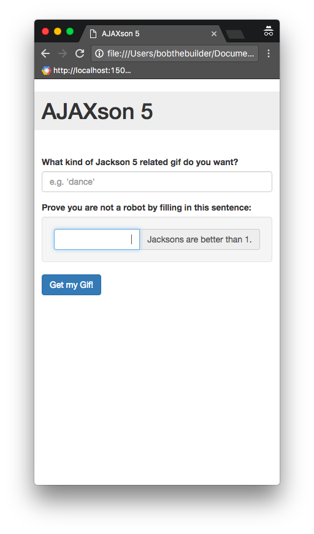

# Assignment: The AJAXson 5

One of the classic problems in computer science is the question of how to optimally implement a web page that displays GIFs of the Jackson 5. Today you'll take a stab at it.

## The Giphy API

You are going to use the <a href="https://github.com/Giphy/GiphyAPI" target="_blank">Giphy API</a>, whose purpose, as you might guess, is to serve up GIFs to developers.

The basic goal of your page will be to fetch a GIF from Giphy, and then insert it into the DOM to display it on your page. We'll get into the details shortly, but first, let's play with Giphy for a minute.

#### The host

The host url we want is `https://api.giphy.com/v1/gifs/`. Let's try sending a GET request to that url. Try entering the following command into your terminal:

```nohighlight
$ curl -G https://api.giphy.com/v1/gifs/
{"meta":{"status":404,"msg":"Not Found!"}}
```

We recieved a 404 Not Found response from Giphy. Maybe they ran out of GIFs?

#### The Endpoint

Actually, the problem is that we need to choose an "endpoint" to indicate which specific service we want. The endpoints are all listed in the documentation linked above, so check them out if you are interested. For this assignment, we will use the Random endpoint, which, upon receiving a request, responds with a randomly chosen GIF related to a particular topic (unless you don't provide a specific topic, in which case you'll get back a *very* random GIF).

The url for the Random endpoint is simply `/random`, so let's try this:

```nohighight
$ curl -G https://api.giphy.com/v1/gifs/random
{"meta":{"status":403,"msg":"Forbidden"}}
```

This time we got a different error, 403 Forbidden. Like most APIs, Giphy requires us to authorize ourselves with a key. Luckily, they make a public "Beta" key available for people like us who are just testing, playing around, or doing LaunchCode Assignments. The key is "dc6zaTOxFJmzC".

#### Adding Params: api_key

Let's authorize ourselves by including in our request a parameter whose value is that magic string and whose key name is "api_key".

We can associate data with our curl request by using the -d flag:

```nohighlight
$ curl -G https://api.giphy.com/v1/gifs/random -d api_key=dc6zaTOxFJmzC
{"data":{"type":"gif","id":"RBLigAVE0xJte","url":"http:\/\/giphy.com\/gifs\/food-dessert-etc-RBLigAVE0xJte","image_original_url":"http:\/\/media1.giphy.com\/media\/RBLigAVE0xJte\/giphy.gif","image_url":"http:\/\/media1.giphy.com\/media\/RBLigAVE0xJte\/giphy.gif","image_mp4_url":"http:\/\/media1.giphy.com\/media\/RBLigAVE0xJte\/giphy.mp4","image_frames":"35","image_width":"245","image_height":"180","fixed_height_downsampled_url":"http:\/\/media1.giphy.com\/media\/RBLigAVE0xJte\/200_d.gif","fixed_height_downsampled_width":"272","fixed_height_downsampled_height":"200","fixed_width_downsampled_url":"http:\/\/media1.giphy.com\/media\/RBLigAVE0xJte\/200w_d.gif","fixed_width_downsampled_width":"200","fixed_width_downsampled_height":"147","fixed_height_small_url":"http:\/\/media1.giphy.com\/media\/RBLigAVE0xJte\/100.gif","fixed_height_small_still_url":"http:\/\/media1.giphy.com\/media\/RBLigAVE0xJte\/100_s.gif","fixed_height_small_width":"136","fixed_height_small_height":"100","fixed_width_small_url":"http:\/\/media1.giphy.com\/media\/RBLigAVE0xJte\/100w.gif","fixed_width_small_still_url":"http:\/\/media1.giphy.com\/media\/RBLigAVE0xJte\/100w_s.gif","fixed_width_small_width":"100","fixed_width_small_height":"73","username":"","caption":""},"meta":{"status":200,"msg":"OK"}}
```

We got some stuff! It's not very readable, but if we paste it into a [JSON Prettifyier](http://jsonprettyprint.com), we can see the structure very clearly:

```nohighlight
{
  "data": {
    "type": "gif",
    "id": "RBLigAVE0xJte",
    "url": "http:\/\/giphy.com\/gifs\/food-dessert-etc-RBLigAVE0xJte",
    "image_original_url": "http:\/\/media1.giphy.com\/media\/RBLigAVE0xJte\/giphy.gif",
    "image_url": "http:\/\/media1.giphy.com\/media\/RBLigAVE0xJte\/giphy.gif",
    "image_mp4_url": "http:\/\/media1.giphy.com\/media\/RBLigAVE0xJte\/giphy.mp4",
    "image_frames": "35",
    "image_width": "245",
    "image_height": "180",
    ...
  },
  "meta": {
    "status": 200,
    "msg": "OK"
  }
}
```

That's a lot of data for just one GIF. For our purposes, the only thing we care about is the value of the `"image_url"` key, which is inside of the `"data"` key:

```nohighlight
http:\/\/media3.giphy.com\/media\/RBLigAVE0xJte\/giphy.gif
```

If we fix up the "escaped" forward slashes, we get a valid url to a GIF!

```nohighlight
http://media3.giphy.com/media/RBLigAVE0xJte/giphy.gif
```

And then, if we set this url as the `"src"` attribute of an `` tag in HTML, like so:

```html

```

the result will be a GIF on our page!


#### Adding Params: tag

But artisan lollipops is a topic for another time, beacause today is all about the Jacksons. To specify the topic of interest, we simply need to add another data parameter with the key "tag" and the value "jackson+5":

```nohighlight
$ curl -G https://api.giphy.com/v1/gifs/random -d api_key=dc6zaTOxFJmzC -d tag=jackson+5
```

which should respond with a GIF like this one:


Much better!

## The Goal

Your site should provide the user with a form where she can type a search query:


Upon submitting the form, the user should briefly see an indication that something awesome is about to happen:


After a little while, the user should see a GIF appear!


If the user clicks the button again, even with the same search term, a new request should be sent, yielding a (probably) new GIF:


The gif should ideally be relevant to both the user's search term ("dance" in this case) and the Jackson 5 (or at least Michael), but depending on the search term, and just luck-of-the-draw, you might find that only one or the other could be satisfied. For example, a third click might yield this:


Dance: check. Jacksons: not so much. That's OK if the results don't quite work out, as long as you put in the effort and heart and soul (where "effort and heart and soul" means your form submitted to Giphy a request in which the "tag" key had a value of `"Jackson 5 dance"`).

Finally, it is possible that something might go wrong in the proccess of making the request. If so, you should report an error to the user, like so:


## Obtaining the Starter Code

1. Visit our [starter-code repository][starter-repo] on Github.
2. **Fork** our repo by pressing the "Fork" button. You will now have your own version of the project, hosted on your Github profile.
3. Back on your terminal, us `cd` to navigate to the place in your file system where to the place you want this project to live.
4. Clone your remote repo:

	```nohighlight
	$ git clone https://github.com/bobthebuilder/the-ajaxson-5
	```

	where `bobthebuilder` is your own username.

[starter-repo]: https://github.com/LaunchCodeEducation/the-ajaxson-5

## Take a Look

Look inside the folder:

```nohighlight
$ cd the-ajaxson-5/
$ ls
index.html request-gif.js
```
You should see only two files: `index.html` and `request-gif.js`.


#### index.html

In `index.html` we have four main things:
* a `<form>` where the user can type a search query and request a new GIF
* an `` where the GIF will be displayed
* a `<p>` that we can use to report feedback about the image loading or an error having occured.
* a couple `<script>` tags to load jQuery and our own `request-gif.js` script.

#### request-gif.js

You will do all your work inside `request-gif.js`. Open it up now and take a look.

In broad terms, this script's job is to set things up such that:
  * when the `<form>` is submitted, an AJAX request will be sent out to Giphy asking for a new random GIF
  * when a response comes back from Giphy, the new GIF will be displayed

The first block of code in the file contains this line:
```js
$("#form-gif-request").submit(fetchAndDisplayGif);
```
which uses jQuery to search the DOM for our form (by querying for an element whose `id` is `"form-gif-request"`), and then attaches, to that form's `submit` event, a "callback" function named `fetchAndDisplayGif`, which we have defined elsewhere in the file. The result is that whenever the form is submitted, our `fetchAndDisplayGif` function will be invoked.

The above line is, itself, inside of another callback, an annonymous function that we pass to jQuery's `document.ready()` function. This ensures that we do not execute that line until the HTML document has finished loading and is "ready" (because if we don't wait, then this code might execute before the `<form>` has loaded, in which case our `$("#form-gif-request")` query will fail to find anything).

Let's continue on to the `fetchAndDisplayGif()` function. This is where you will do all your work. You will see a handful of TODOs sprinkled throughout the body of this function. The code that is in there currently provides a skeleton for the following gameplan:

1. query the DOM to figure out what the user typed
2. make an ajax request
3. when the request comes back, modify the DOM so that the new GIF is shown.

To make the AJAX request, we use jQuery's `ajax()` function. In some of the CS50 examples so far, you might have seen David Malan and co. using a similar jQuery function called `getJson()`. Both functions do the exact same thing. The only difference is that `ajax()` lets you customize a little more (with the downside of being a little more complicated). But it's actually not so bad. The gist is that we are calling the `ajax()` function and passing it a big object to specify all the settings we want to configure:
* `url` -- the url that we want to talk to
* `data` -- any extra data that we want to send along with our request (in our case, the api_key and tag)
* `success` -- a callback function to execute when the response comes back
* `error` -- an alternative callback function, if something went wrong, to handle the error

There are many more settings you can configure, but those are the core things we care about in this case.

The last section of this function is a TODO where we instruct you to give the user a "Loading..." message while they wait for the response to come back. You might be wondering: Why are we displaying a loading message AFTER we've already done the whole request and handled the response in the `success()` (or `error()`) function? Remember, those callback functions will not actually be *executed* until later, after the response comes back. Just because the `success()` function is defined *above* line 53 does not mean that it will actually be invoked before line 53.

The final piece of code in the file is a helper function called `setGifLoadedStatus()` which we have written, which you can use to toggle the visibility of the `` and `<p>` tags in the HTML page. Depending on the situation, you are either going to want one to be visible and the other hidden, or vice versa, so this function makes it easy to flip back and forth between those two possible states.

## Your Task

The assignment has 3 parts:

#### Part 1: Core Functionality

This part is easy to explain: go ahead and fill in those `TODO` comments!

You know you are done when your site performs all the functionality described in the [The Goal](./#the-goal) section above.

You may find the following jQuery functions helpful:

* `$(someSelector).attr()`
* `$(someSelector).html()`
* `$(someSelector).val()`
* `$(someSelector).find()`

#### Part 2: Validation

Next, it is time to add some validation to the page. We are going to create a contrived scenario here, just to make you practice your skillz.

You know those "Prove you are not a robot" CAPTCHA widgets? Your  job is to create one of those, albiet a nontraditional one. Specifically,  the task is as follows:

Add a second field to your form. It should look like this:


If the user gets the answer right, then go ahead and load the GIF like normal.

If not, bring the hammer down:


Of course, this would actually be a terribly ineffective way to prevent robots from searching for GIFs on your site, so don't go getting any ideas that this is something you should actually do In Real Life.


#### Part 3: Beauty

Finally, add some CSS to make your page beautiful and responsive.

Here is an example of a nicer looking page:




But feel free to get creative and style the page however you want.

The one requirement is that your page **must be reasonably responsive!**. Specifically, this means that it must be equally functional and non-ugly on mobile phones as it is on larger desktop screens. You should make your browser window really narrow while you design, so as to force yourself to think "mobile first".

You are encouraged (but not required) to let [Bootstrap](http://getbootstrap.com/css/) do most of the heavy lifting, particularly on the responsiveness aspect.

## How to Submit

1. In a terminal `add` and `commit` your changes.
2. Then `push` your local changes up to your remote repo. You should then see your latest code up on Github if you visit your remote repo.
3. Go to Vocareum and find the assignment called "The AJAXson 5".
4. In your Vocareum work environment, `clone` the project down from your remote repo.
5. Click Submit.
6. Demo for a TF.
7. Hit the dance floor!
